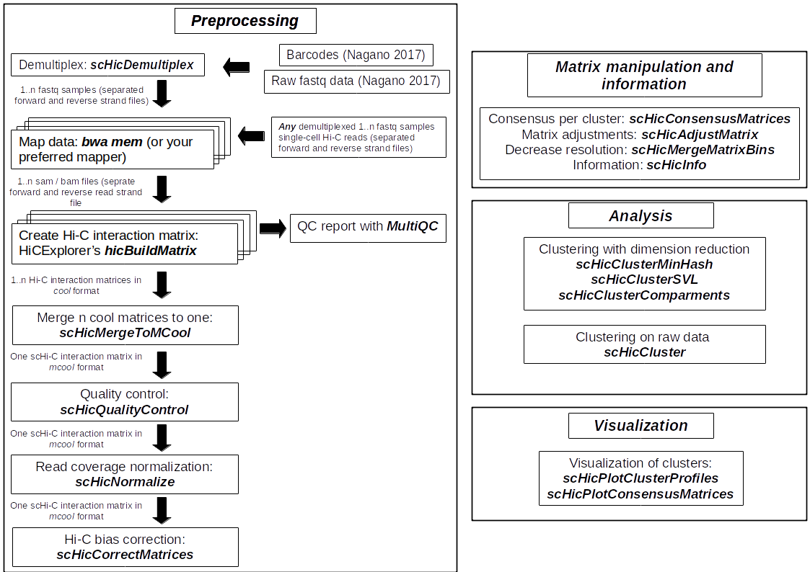

|azure| |rtd| |conda|

.. |azure| image:: https://dev.azure.com/wolffj/scHiCExplorer/_apis/build/status/joachimwolff.scHiCExplorer?branchName=master
	:target: https://dev.azure.com/wolffj/scHiCExplorer/_build/latest?definitionId=1&branchName=master
.. |rtd| image:: https://readthedocs.org/projects/schicexplorer/badge/?version=latest
   :target: http://schicexplorer.readthedocs.io/?badge=latest
.. |conda| image:: https://anaconda.org/bioconda/schicexplorer/badges/installer/conda.svg   
   :target: https://conda.anaconda.org/bioconda

scHiCExplorer
=============

The scHiCExplorer is a software to demultiplex, process, correct, normalize, manipulate, analyse and visualize single-cell Hi-C data. scHiCExplorer supports the mcool file format and stores per cell one Hi-C interaction matrix in it.

Citation
--------

Joachim Wolff, Leily Rabbani, Ralf Gilsbach, Gautier Richard, Thomas Manke, Rolf Backofen, Björn A Grüning.
**Galaxy HiCExplorer 3: a web server for reproducible Hi-C, capture Hi-C and single-cell Hi-C data analysis, quality control and visualization, Nucleic Acids Research**, Volume 48, Issue W1, 02 July 2020, Pages W177–W184, https://doi.org/10.1093/nar/gkaa220

Joachim Wolff, Nezar Abdennur, Rolf Backofen, Björn Grüning.
**Scool: a new data storage format for single-cell Hi-C data, Bioinformatics**, Volume 37, Issue 14, 15 July 2021, Pages 2053–2054, https://doi.org/10.1093/bioinformatics/btaa924

Joachim Wolff, Rolf Backofen, Björn Grüning.
**Robust and efficient single-cell Hi-C clustering with approximate k-nearest neighbor graphs, Bioinformatics**, btab394, https://doi.org/10.1093/bioinformatics/btab394

Availability
------------

The easiest way to install scHiCExplorer is using `BioConda <http://bioconda.github.io/>`_

::

   $ conda install schicexplorer -c bioconda -c conda-forge

Install by cloning this repository
__________________________________

You can install any one of the HiCExplorer branches on command line
(linux/mac) by cloning this git repository:

::

    $ git clone https://github.com/joachimwolff/scHiCExplorer.git
    $ cd scHiCExplorer
    $ python setup.py install

However, please take care all dependencies are installed, see the requirements.txt file.

Documentation
-------------

Please visit our complete documentation on `readthedocs <https://schicexplorer.readthedocs.org/>`_.
